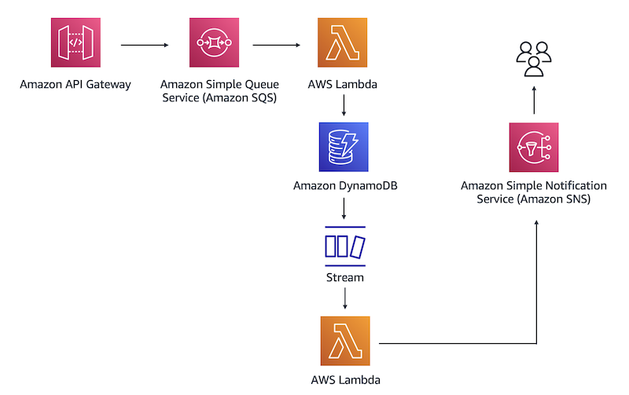

# aws-serverless-1
APIGateway, SQS, Lambda, DynamoDB, DynamoDB Stream, SNS

# Test send message
curl -X POST -d '{"message": "Hello from API Gateway"}' \
     -H "Content-Type: application/json" \
     "https://your-api-id.execute-api.region.amazonaws.com/prod/<account ID>/POC-Queue"

# Flow
API Gateway > SQS > Lambda 1 > DynamoDB > DynamoDB stream > Lambda 2 > SNS (send email)

